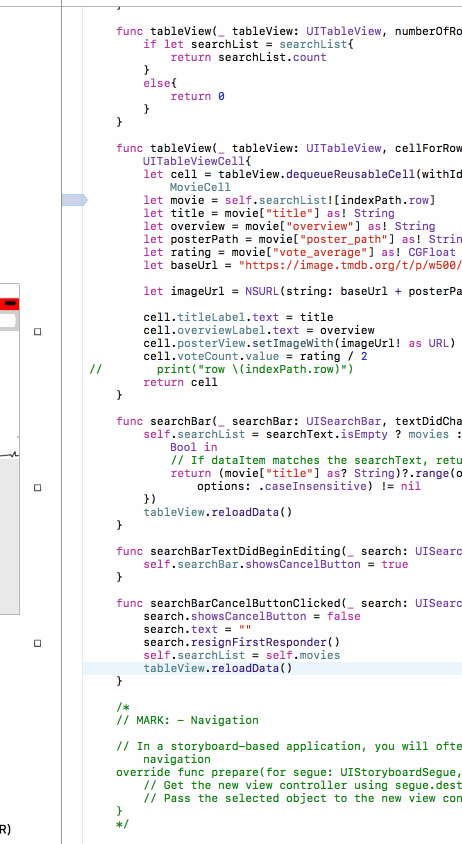

Flicks Movie

**Flicks Movie** is a movies app displaying box office and top rental DVDs using [The Movie Database API](http://docs.themoviedb.apiary.io/#).

Time spent: **7** hours spent in total

## User Stories

The following **required** functionality is completed:

- [x] User can view movie details by tapping on a cell.
- [x] User can select from a tab bar for either **Now Playing** or **Top Rated** movies.
- [x] Customize the selection effect of the cell.

The following **optional** features are implemented:

- [x] For the large poster, load the low resolution image first and then switch to the high resolution image when complete.
- [x] Customize the navigation bar.

The following **additional** features are implemented:

- [x] Added Upcoming movies section in the navigation bar where users can view newly releasing movies
- [x] Users can now view the trailers for the movies by clicking on the poster in the detail views
- [x] Users can now see the rating of the movies in the detail view screen
- [x] Users can also see the rating content of the movie which is displayed by pictures such as PG-13 or Adult
- [x] Improved the UI and changed the scroll view to show details on scrolling up

Please list two areas of the assignment you'd like to **discuss further with your peers** during the next class (examples include better ways to implement something, how to extend your app in certain ways, etc):

1. Using newer pods to do interesting things

## Video Walkthrough 

Here's a walkthrough of implemented user stories:

GIF created with [LiceCap](http://www.cockos.com/licecap/).

## Notes

Describe any challenges encountered while building the app.

1. Using the autoplay feature for youtube was very difficult. I tried using many different pods but was not successful on making the videos play automatically.

Copyright [2017] [Aarya BC]

Licensed under the Apache License, Version 2.0 (the "License");
you may not use this file except in compliance with the License.
You may obtain a copy of the License at

http://www.apache.org/licenses/LICENSE-2.0

Unless required by applicable law or agreed to in writing, software
distributed under the License is distributed on an "AS IS" BASIS,
WITHOUT WARRANTIES OR CONDITIONS OF ANY KIND, either express or implied.
See the License for the specific language governing permissions and
limitations under the License.

# Project 1 - Flicks

Flicks is a movies app using the [The Movie Database API](http://docs.themoviedb.apiary.io/#).

Time spent: 6 hours spent in total

## User Stories

The following **required** functionality is complete:

- [x] User can view a list of movies currently playing in theaters from The Movie Database.
- [x] Poster images are loaded using the UIImageView category in the AFNetworking library.
- [x] User sees a loading state while waiting for the movies API.
- [x] User can pull to refresh the movie list.

The following **optional** features are implemented:

- [x] User sees an error message when there's a networking error.
- [ ] Movies are displayed using a CollectionView instead of a TableView.
- [x] User can search for a movie.
- [ ] All images fade in as they are loading.
- [x] Customize the UI. Changed the separator between two cells for a better look to the UI.

The following **additional** features are implemented:

- [x] Added a cancel button to the search menu and it loads the default results once the user hits cancel
- [x] Added a ratings view where the user can see the ratings of the movie in starts format.

Please list two areas of the assignment you'd like to **discuss further with your peers** during the next class (examples include better ways to implement something, how to extend your app in certain ways, etc):

1. Using different views and switching over views from different controllers
2. Using an embedded browser to play videos or songs for trailer

## Video Walkthrough 

Here's a walkthrough of implemented user stories:

GIF created with [LiceCap](http://www.cockos.com/licecap/).

## Notes

Describe any challenges encountered while building the app.

## License

    Copyright 2017 [Aarya BC]

    Licensed under the Apache License, Version 2.0 (the "License");
    you may not use this file except in compliance with the License.
    You may obtain a copy of the License at

        http://www.apache.org/licenses/LICENSE-2.0

    Unless required by applicable law or agreed to in writing, software
    distributed under the License is distributed on an "AS IS" BASIS,
    WITHOUT WARRANTIES OR CONDITIONS OF ANY KIND, either express or implied.
    See the License for the specific language governing permissions and
    limitations under the License.
